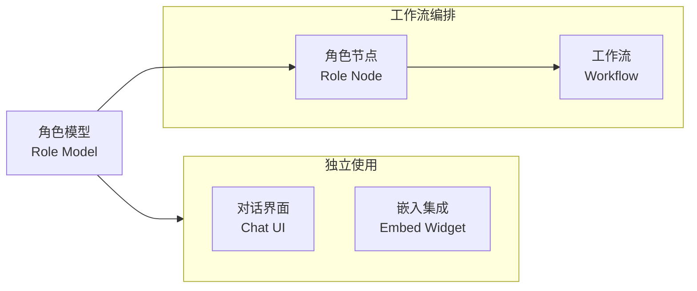
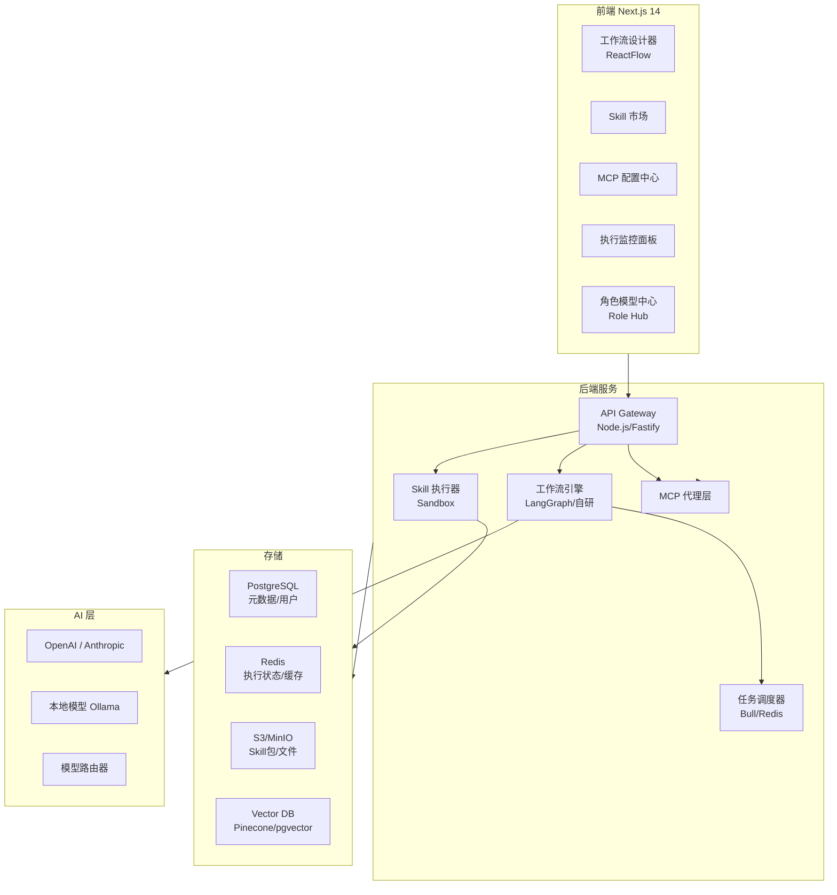

# AI Agent 工作流平台 PRD

## 一、产品定位

**产品名称：** AgentFlow（暂定）

**核心价值：** 让任何人（非开发者）都能通过可视化界面，为不同垂直领域设计专属 AI 角色，并将角色、技能（Skills）、外部服务（MCP）自由组合成自动化工作流，实现复杂业务的智能自动化。

---

## 二、用户角色

- **普通用户（Citizen AI Builder）** — 无代码搭建工作流、使用技能市场现成技能
- **技能开发者（Skill Developer）** — 发布、维护技能包到市场
- **团队管理员（Workspace Admin）** — 管理成员权限、MCP 服务器连接、API Key
- **平台运营（Platform Admin）** — 审核上架技能、管理计费

---

## 三、核心模块

### 模块 0：角色模型中心（Role Model Hub）⭐ 新增

**定位：** 平台的「灵魂层」，用于设计、管理、复用各垂直领域的 AI Agent 人格与能力边界。角色既可独立对话使用，也可作为节点被工作流编排。

**功能列表：**

- **角色创建向导** — 填写角色名称、领域标签、头像；通过引导式表单或自由编辑生成 System Prompt
- **垂直领域模板库** — 内置常用行业角色模板，一键套用：


| 领域   | 内置角色示例                             |
| ---- | ---------------------------------- |
| 客户服务 | 智能客服、售后专员、投诉处理官                    |
| 法律   | 合同审查员、法律顾问助手                       |
| 医疗健康 | 健康顾问（免责声明模式）、用药提醒助手                |
| 软件开发 | Code Review 专家、架构设计顾问、Debugging 助手 |
| 教育培训 | 1v1 辅导教师、考试出题助手                    |
| 金融   | 财报分析师、理财规划助手                       |
| 电商   | 选品顾问、营销文案专家                        |


- **角色属性配置：**
  - **基础设定** — System Prompt（支持 Prompt 模板变量 `{{user_name}}`）、语言风格（专业/亲切/严谨）、回复长度偏好
  - **模型绑定** — 为角色绑定特定 LLM（GPT-4o / Claude 3.5 / 本地模型），设置 Temperature、Top-P 等参数
  - **技能挂载** — 从技能市场为角色装配 Skills（如：搜索、计算器、日历查询）
  - **MCP 工具授权** — 指定角色可调用哪些 MCP Server 的工具
  - **知识库绑定** — 为角色挂载私有知识库（RAG），支持上传文档/URL
  - **记忆策略** — 配置短期记忆窗口大小、是否开启长期记忆、记忆摘要策略
  - **安全护栏** — 设置话题黑名单、敏感词过滤、越权拒绝策略
- **角色测试沙盒** — 在配置页内直接与角色对话，实时验证人设是否符合预期
- **角色发布与共享：**
  - 发布为团队公共角色（Team Role）
  - 发布到平台角色市场（需审核）
  - 生成独立嵌入链接（Embed Widget），供外部系统集成
- **版本管理** — 角色配置版本快照，支持 A/B 测试不同版本人设
- **使用统计** — 对话量、任务完成率、用户满意度评分

**角色数据模型（Role Manifest）：**

```json
{
  "id": "legal-advisor-v1",
  "name": "法律顾问助手",
  "domain": "legal",
  "avatar": "...",
  "system_prompt": "你是一位专业的中国法律顾问，擅长合同法、劳动法...",
  "model": {
    "provider": "anthropic",
    "model_id": "claude-3-5-sonnet",
    "temperature": 0.3
  },
  "skills": ["web-search", "document-parser"],
  "mcp_servers": ["filesystem-mcp"],
  "knowledge_bases": ["kb_legal_cn_2024"],
  "memory": {
    "window_size": 20,
    "long_term": true
  },
  "guardrails": {
    "topic_blacklist": ["投资建议", "违法活动"],
    "safe_mode": true
  }
}
```

**角色与工作流的关系：**




> 角色可独立作为对话助手部署，也可被拖入工作流画布作为「角色节点」，在特定步骤中调用该角色的完整人设+技能+工具能力。

---

### 模块 1：Skill 技能市场

**功能列表：**

- **浏览与搜索** — 按类别（Web 搜索、代码执行、数据分析、文件处理、通知推送等）、标签、评分筛选
- **技能详情页** — 功能描述、输入/输出参数 Schema、版本历史、用户评分、使用案例 Demo
- **一键安装** — 安装到个人/团队技能库，支持版本锁定
- **发布工作台** — 开发者上传 Skill 包（JSON Schema + 执行逻辑），填写文档，提交审核
- **版本管理** — Semver 版本控制，Changelog
- **我的技能库** — 已安装技能列表，支持启用/禁用、升级、卸载

**技能包格式（Skill Manifest）：**

```json
{
  "id": "web-search-v2",
  "name": "Web Search",
  "version": "2.1.0",
  "category": "information",
  "input_schema": { ... },
  "output_schema": { ... },
  "runtime": "nodejs|python|http",
  "entry": "index.js"
}
```

---

### 模块 2：MCP 配置中心

**功能列表：**

- **MCP 服务器管理** — 添加、编辑、删除 MCP 服务器连接（支持 stdio / SSE / HTTP 三种传输协议）
- **连接测试** — 可视化测试 MCP 连接状态，展示可用 Tool 列表
- **MCP 市场** — 内置常用 MCP 服务器模板（Filesystem、PostgreSQL、GitHub、Slack、Figma 等）
- **凭证管理** — 加密存储 API Key / Token，支持环境变量引用
- **工具预览** — 查看 MCP Server 暴露的所有 Tools 及其参数说明，支持在线 Try-It
- **工作区共享** — 将 MCP 连接共享给团队成员使用

**MCP 配置结构：**

```json
{
  "server_id": "github-mcp",
  "display_name": "GitHub MCP",
  "transport": "stdio",
  "command": "npx @modelcontextprotocol/server-github",
  "env": {
    "GITHUB_TOKEN": "{{secrets.GITHUB_TOKEN}}"
  }
}
```

---

### 模块 3：AI 工作流设计器

**功能列表：**

- **可视化画布** — 基于 ReactFlow 的节点连线拖拽界面，支持缩放、对齐、分组
- **节点类型库：**


| 类别    | 节点                                          |
| ----- | ------------------------------------------- |
| 触发器   | 手动触发、定时任务（Cron）、Webhook、事件监听                |
| AI 节点 | LLM 对话、**角色节点（Role Node）**、Agent 自主执行、结构化输出 |
| 工具节点  | Skill 调用、MCP Tool 调用、HTTP 请求、代码执行           |
| 逻辑节点  | 条件分支（If/Else）、循环（forEach/While）、并行执行、合并     |
| 数据节点  | 变量赋值、数据转换（JSONata/JMESPath）、模板渲染            |
| 人工节点  | 人工审批、人工输入、通知节点                              |


- **工作流配置面板** — 右侧属性面板配置每个节点的参数（支持变量插值 `{{node.output}}`）
- **实时调试** — Step-by-step 单步执行，查看每个节点的输入/输出数据
- **执行历史** — 工作流运行记录、日志查看、失败重试
- **模板市场** — 一键使用官方/社区工作流模板
- **版本控制** — 工作流草稿/发布状态，历史版本回滚
- **变量系统** — 全局变量、工作流变量、节点间数据传递

---

## 四、技术架构




**技术选型：**

- **前端：** Next.js 14 (App Router) + TypeScript + TailwindCSS + shadcn/ui + ReactFlow
- **后端：** Node.js + Fastify（API 层）+ Python FastAPI（AI 执行层）
- **工作流引擎：** LangGraph（Agent 节点）+ 自研 DAG 调度器（逻辑节点）
- **数据库：** PostgreSQL（主数据）+ Redis（状态/队列）+ pgvector（RAG）
- **文件存储：** MinIO（自托管）/ AWS S3
- **Skill 沙箱：** Docker 容器隔离执行 / Deno Deploy（轻量）
- **认证：** NextAuth.js + JWT + RBAC
- **部署：** Docker Compose（开发）/ Kubernetes（生产）

---

## 五、数据模型（核心实体）

- **User / Organization / Workspace** — 多租户体系
- **RoleModel** — 角色配置（System Prompt + 模型参数 + 技能挂载 + MCP授权 + 知识库 + 护栏）+ 版本
- **KnowledgeBase** — 知识库（文档列表 + 向量索引引用）
- **Skill** — 技能包元信息 + 版本 + 安装记录
- **MCPServer** — 服务器配置 + 凭证（加密）
- **Workflow** — 工作流定义（节点JSON + 边JSON）+ 版本
- **WorkflowExecution** — 运行实例 + 状态 + 日志
- **NodeExecution** — 单节点运行记录 + 输入/输出快照
- **ConversationSession** — 独立对话会话（与角色直接对话时产生）

---

## 六、项目目录结构

```
aiAent/
├── frontend/                    # Next.js 14 前端
│   ├── app/
│   │   ├── (auth)/             # 登录/注册
│   │   ├── roles/              # 角色模型中心
│   │   ├── workflow/           # 工作流设计器
│   │   ├── skills/             # 技能市场
│   │   ├── mcp/                # MCP 配置中心
│   │   └── executions/         # 执行监控
│   ├── components/
│   │   ├── role-hub/           # 角色配置相关组件
│   │   ├── workflow-editor/    # ReactFlow 相关组件
│   │   ├── skill-market/
│   │   └── mcp-config/
│   └── lib/
├── backend/
│   ├── api/                    # Fastify API 服务
│   │   ├── routes/
│   │   └── middlewares/
│   ├── engine/                 # 工作流执行引擎
│   │   ├── scheduler/
│   │   ├── nodes/
│   │   └── runtime/
│   ├── role-service/           # 角色管理与对话服务
│   │   ├── chat/               # 独立对话 Session 处理
│   │   ├── memory/             # 记忆策略（短期/长期）
│   │   └── guardrails/         # 安全护栏
│   ├── rag-service/            # 知识库/向量检索服务
│   ├── mcp-proxy/              # MCP 代理服务
│   └── skill-runner/           # Skill 沙箱执行器
├── packages/
│   ├── shared-types/           # 前后端共享类型
│   └── skill-sdk/              # Skill 开发 SDK
├── docker-compose.yml
└── turbo.json                  # Monorepo (Turborepo)
```

---

## 七、MVP 范围（Phase 1）

**优先实现（4-6周）：**

- 用户认证（登录/注册/工作区）
- 角色模型中心基础版（创建角色、配置 System Prompt、绑定模型、测试沙盒）
- 工作流设计器基础版（LLM节点 + 角色节点 + HTTP节点 + 条件分支 + 手动触发）
- 工作流执行引擎 + 执行日志查看
- MCP 配置（添加/测试/使用 MCP Server）
- Skill 市场基础版（浏览/安装/在工作流中使用）

**Phase 2（扩展，6-10周）：**

- 角色知识库（RAG）+ 长期记忆系统
- 角色市场（浏览/安装他人发布的角色）
- 角色 Embed Widget（生成可嵌入外部网站的对话组件）
- Skill 发布工作台（开发者上传）
- 定时/Webhook 触发器
- 团队协作（多人编辑、权限管理）
- 工作流模板市场
- 执行监控仪表盘

**Phase 3（商业化，10周+）：**

- 计费系统（执行次数/团队席位）
- 企业私有部署
- 审计日志
- SLA 保障

---

## 八、关键用户故事

1. 作为电商运营，我可以在角色中心创建「选品顾问」角色，配置电商领域 System Prompt + 商品数据库 MCP，直接与它对话获得选品建议
2. 作为开发团队负责人，我可以把「Code Review 专家」角色拖入工作流，在 PR 创建时自动触发代码审查并评论到 GitHub
3. 作为普通用户，我可以在 10 分钟内通过拖拽搭建一个「GitHub PR 自动摘要并发送到 Slack」的工作流
4. 作为开发者，我可以将自己开发的 Python 脚本封装成 Skill 发布到市场，并在角色配置中为角色装配该技能
5. 作为管理员，我可以统一配置团队的 MCP 服务器，让成员在角色/工作流中直接使用而无需关心凭证
6. 作为用户，我可以查看工作流每次运行的详细日志，定位哪个节点失败并重试

